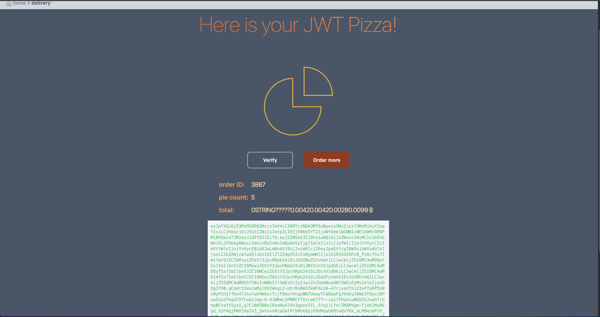
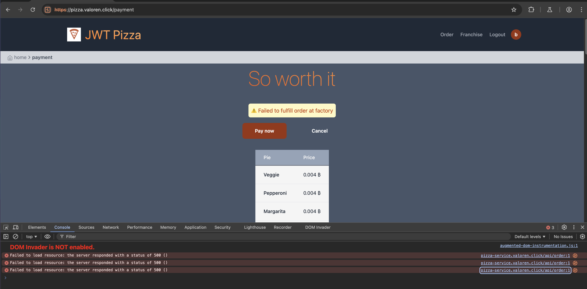
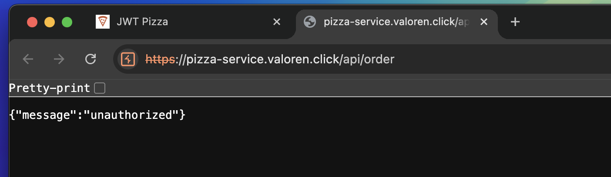

Eli Ellsworth
I only was able to do a self attack, though I got my roommate who is a cyber security major to also try penetrating it.

attack 1:
Target pizza.valoren.click
Classification: proxy manipulation / injection
Severity: 2
Description: Was able to manipulate https queries for payment to replace price values with strings, caused errors on both client and user side. Was unable to access databases for a few minutes afterwards

attack 2:
Target pizza.valoren.click
Classification: leaked credentials
Severity: 1
Description: Roommate was able to guess admin credentials and had free reign

There was also some odd behavior possible by manipulating the request bodies of purchases that could lead to the database, but I ran out of time to do those tests. 

This was interesting, but I think penetration and security really needs it's own class instead of just the last unit, there was a lot of guesswork trying to figure out what to do, and even my roommate who is supposed to be doing this for his major had trouble getting started. We were able to temporarily disrupt my site and my logs are a bit of a mess, but not take it down.